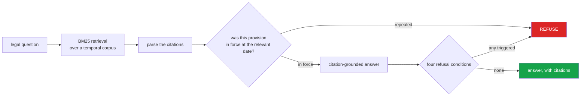

<h1 align="center">pak-law-assistant</h1>
<p align="center"><i>Legal question answering over Pakistani statutes that will not cite a repealed provision</i></p>

<p align="center">
  <a href="#the-failure-this-exists-to-prevent">The failure it prevents</a> &middot;
  <a href="#four-refusal-conditions">Four refusals</a> &middot;
  <a href="#citation-parsing">Citation parsing</a> &middot;
  <a href="#why-bm25-and-not-embeddings">Why BM25</a> &middot;
  <a href="#amendment-history-is-often-the-question-itself">Amendment history</a> &middot;
  <a href="#problems-hit-while-building-this">Problems hit</a>
</p>

<p align="center">
  <a href="https://github.com/hammas159/pak-law-assistant/actions/workflows/ci.yml"></a>
  
  
  
  <a href="LICENSE"></a>
</p>

---

## The failure this exists to prevent



**Citing a repealed provision is worse than refusing to answer.** The corpus is temporal,
so "what does the law say" is always resolved as "what did the law say *on this date*".


Ask a normal RAG system *"what is the punishment under section 20 PECA?"* and it
retrieves the text of section 20, which is confident, specific, correctly cited — and
possibly describes a provision that was **substituted in 2022**.

A repealed section reads exactly like a live one. Nothing in the text says otherwise.
Only the corpus knows, and only if it was built to.

That is worse than refusing, because a refusal makes someone check and a confident
citation does not. Here is the same question, twice:

```python
assistant.answer("punishment under section 20 PECA", as_of="2026-09-11")
→ Section 20 PECA  (2022-02-20 → current)
  "...imprisonment which may extend to five years."

assistant.answer("punishment under section 20 PECA", as_of="2018-01-01")
→ Section 20 PECA  (2016-08-19 → 2022-02-20)
  "...imprisonment which may extend to three years."
```

**A flat corpus answers both identically, and one of those answers is wrong.**

Every provision carries the dates it was in force. Retrieval is always *as of* a date —
there is no way to search without supplying one, because an optional date parameter
gets a default and the default eventually gets used for a question where it is wrong.

Superseded text is **retained, not deleted**. Questions about past conduct are asked
against the law as it then stood, and deleting history makes those unanswerable.

## Four refusal conditions

| | What it prevents |
|---|---|
| No provision found | A plausible-sounding answer with no citation |
| **Provision not in force** | An authoritative-looking answer about repealed law |
| Weak match | The nearest provision returned as though it were relevant |
| Cited provision unknown | Answering about a *different* section because it scored well |

A question that **names** a provision is a lookup, not a search. Returning the nearest
match to a citation the user spelled out is how a system answers about the wrong law.

## Citation parsing

Legal writing is citation-dense and precise, and the same provision appears in many
written forms. They must all resolve to one key, or retrieval silently treats them as
different provisions:

```
Section 302 PPC   ·   s. 302 of the Pakistan Penal Code   ·   sec 302, P.P.C.   ·   §302 PPC
                            →  all four:  PPC:section:302
```

Three families, because Pakistani legal argument uses all three:

| | Example |
|---|---|
| **statutory** | `Section 302 PPC`, `Article 25 of the Constitution`, `Order XXXIX Rule 1 CPC` |
| **subordinate** | `SRO 1125(I)/2011` |
| **reported** | `PLD 2015 SC 401`, `2019 SCMR 1234` |

Reported citations matter because a statute's *meaning* frequently lives in the case law
rather than the text. `Order XXXIX Rule 1` parses as **one** citation, not two — civil
procedure is cited by Order and Rule, and splitting it makes the count of authorities in
an answer wrong.

A bare `section 9` gets **no** statute. Context can supply one explicitly, but it is
never guessed: attributing a provision to the wrong Act produces something that looks
exactly like a correct answer.

## Why BM25 and not embeddings

A considered choice for this corpus, not a shortcut.

- **Legal text is terminology-bound.** *"Reasonable apprehension of death"* is a term of
  art. A semantically similar paraphrase is a different provision, and retrieving it is
  a wrong answer. Embeddings are good at paraphrase — the wrong strength here.
- **It is inspectable.** Asked why a provision was returned: *"these terms matched with
  these weights"* is an answer a lawyer can check. *"It was close in a 384-dimensional
  space"* is not, and in a domain where reasoning must be auditable that decides it.

Section numbers are kept as tokens — `302` is among the most discriminating terms in a
penal code — and boosted, so matching a number outranks matching prose. Legal stopwords
(`shall`, `section`, `act`, `person`) are dropped, since nearly every provision contains
them.

## Amendment history is often the question itself

```python
assistant.history("section 20 PECA")
# {"versions": 2, "currently_in_force": True,
#  "history": [{"from": "2016-08-19", "to": "2022-02-20",
#               "manner": "substituted", "amended_by": "Ordinance II of 2022"},
#              {"from": "2022-02-20", "to": None, "manner": "in force"}]}
```

*"When did this change?"* is asked constantly — about conduct that occurred before an
amendment, about which version governs a pending case — and it is **unanswerable from a
flat corpus**.

## Corpus validation

`corpus.validate()` catches the structural faults that produce wrong answers silently:
overlapping versions (retrieval returns whichever it reaches first, so results are not
reproducible), a version that never ends while another begins, gaps in force, and more
than one live version of a provision.

## Tests

**49 tests. No dependencies, no corpus download.**

| Covered | |
|---|---|
| Citations | four written forms → one key, articles, Order+Rule as one, SROs, both law-report orderings, multiple in a sentence, bare sections, subsections |
| Corpus | version on a date, pre-commencement, **boundary belongs to the new version**, history, superseded text retained, impossible intervals, overlap and multi-live detection |
| Retrieval | numbers kept, stopwords dropped, Urdu tokens, ranking, **never returns a repealed provision**, past-date retrieval, explainability, non-negative IDF |
| Answering | **same question, different dates, different answers**, citation lookup vs search, all four refusals, citation-first rendering, history |

## Limits

- **No corpus ships with this repo.** The Pakistan Code is public; the loader takes
  structured provisions and the four demo sections in the tests are illustrative, not
  authoritative. **Do not rely on them.**
- Urdu support is tokenisation-level. Full bilingual retrieval needs the Urdu
  normalisation in [`urdu-nlp-toolkit`](https://github.com/hammas159/urdu-nlp-toolkit)
  wired into the analyser — the interface is there, the integration is not.
- Case law is parsed as citations, not ingested as text. Judicial interpretation is
  frequently where the meaning is, and this retrieves statute only.
- No synthesis. Answers are provision text with citations attached; the system quotes
  law, it does not write it. Narrative phrasing belongs on top, given *verified*
  provisions.
- **This is not legal advice**, and a system that produced fluent legal prose would
  invite reliance it has not earned. The dry, citation-first output is deliberate.

## Keywords

legal AI &middot; legal question answering &middot; statutory interpretation &middot; Pakistani law &middot; citation parsing &middot; repealed provisions &middot; temporal corpus &middot; point-in-time law &middot; BM25 &middot; retrieval &middot; grounded generation &middot; refusal conditions &middot; amendment history &middot; legal tech &middot; zero dependencies

## License

MIT

---

## Run it yourself

```bash
git clone https://github.com/hammas159/pak-law-assistant
cd pak-law-assistant

pip install -e .         # zero dependencies to resolve
pytest -q                # 49 tests, no corpus download
```

```python
from paklaw import Corpus, Provision, LawAssistant

corpus = Corpus()
corpus.add(Provision(statute="PECA", unit="section", number="20",
                     heading="Offences against dignity of a natural person",
                     text=original_text,
                     in_force_from="2016-08-19", in_force_to="2022-02-20",
                     manner="substituted", amended_by="Ordinance II of 2022"))
corpus.add(Provision(statute="PECA", unit="section", number="20",
                     heading="Offences against dignity of a natural person",
                     text=amended_text, in_force_from="2022-02-20"))

corpus.validate()        # overlapping versions, gaps, multiple live versions

a = LawAssistant(corpus=corpus)
a.answer("punishment under section 20 PECA", as_of="2026-09-11").render()
a.answer("punishment under section 20 PECA", as_of="2018-01-01").render()  # different
a.history("section 20 PECA")
```

Loading a corpus is your job — the Pakistan Code is public. The four demo provisions in
the tests are **illustrative and not authoritative; do not rely on them.**

## Problems hit while building this

**Provisions were being attributed to no Act at all.** Statute abbreviations were
normalised by stripping a trailing full stop, which turned the lookup key `p.p.c.` into
`p.p.c` — not in the table. So `sec 302, P.P.C.` parsed as section 302 of *nothing*,
while `Section 302 PPC` resolved correctly, and the two forms of one provision were
treated as different provisions by retrieval. *Fixed* by trying both the dotted and
undotted forms, with a test asserting four written variants produce one key.

**`Order XXXIX Rule 1 CPC` parsed as two citations.** Civil procedure is cited by Order
*and* Rule together; splitting it doubles the count of authorities in an answer. *Fixed*
by consuming matched spans so a more specific pattern wins.

**The first design had an optional `as_of` date.** It defaulted to today, which is
correct until someone asks about conduct from 2019 and gets today's law, fluently and
with a correct-looking citation. *Fixed* by making the date mandatory throughout — an
optional parameter gets a default, and the default eventually gets used for a question
where it is wrong.
